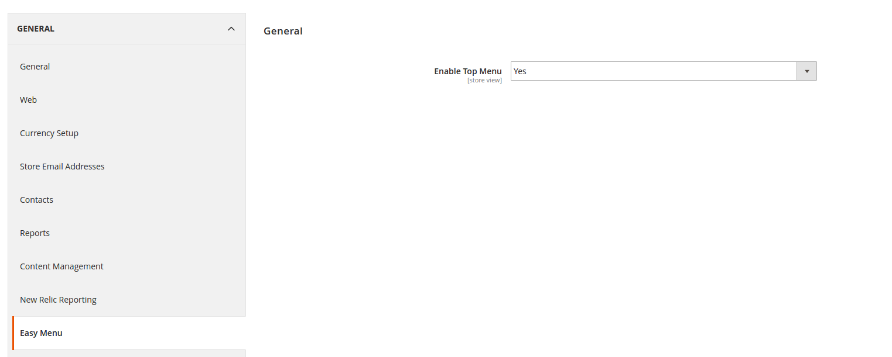
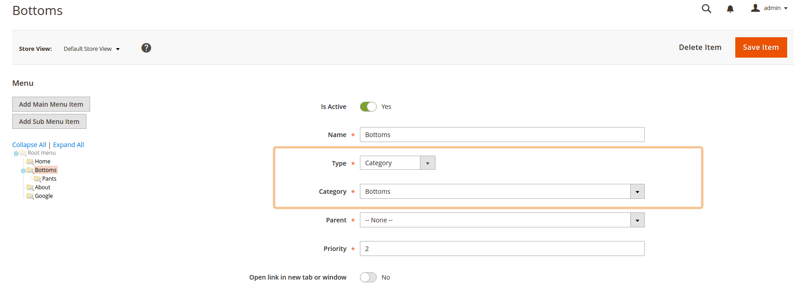
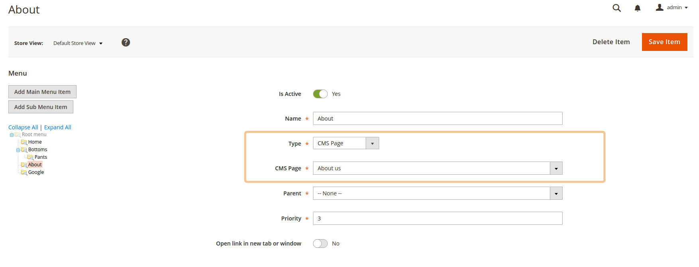
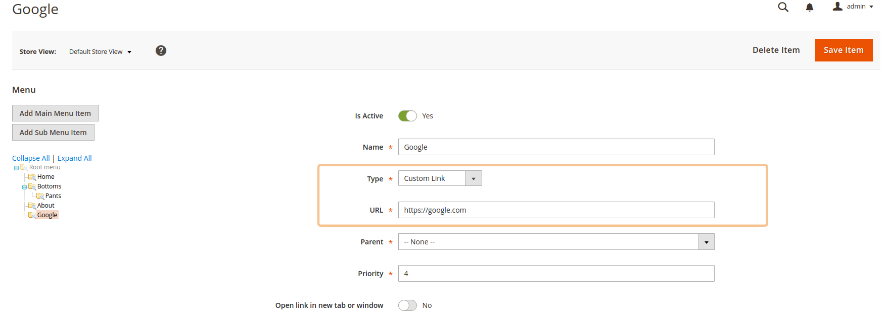
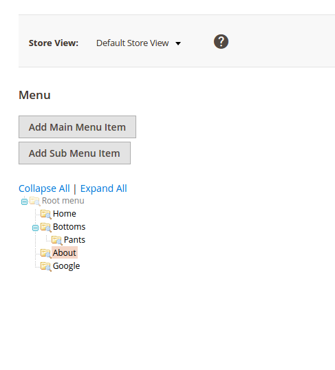

## Setup

## Installation details

Open the composer.json in the Magento 2 root folder add

```json
    {
      "repositories": [
              {
                  "type": "git",
                  "url": "https://github.com/afirlejczyk/magento2-easymenu.git"
              }
          ],
      "minimum-stability": "dev",
      "prefer-stable": true
    }
```

Go to the ssh console at the Magento 2 root folder, 
next please enter the command line 

```composer require afirlejczyk/magento2-easymenu```

#### Enable module ans run EasyMenu setup
 
``` 
php bin/magento module:enable AF_EasyMenu
php bin/magento setup:upgrade
```

## Admin configuration

Navigation menu configurable from the Magento backend.

#### Enable new top menu in backend configuration.
Stores > Configuration > General > Easy Menu > Enable Top Menu.
You can enable options per Store View. 
By default menu is disabled.



For each store view you can create separate menu. You can change store view in to sidebar [screen]

#### Add item and sub item to top menu.
 
- On the Admin Panel, Content > Easy Menu > Manage Top Menu
- Click on Add Main Menu Item/Add Sub Menu Item*
- By default new item is immediately available in store menu

##### For each item you need
- enter Name
- set Type: Category, CMS Page, Custom Link.
- set Parent
- set Priority
- click Save Item 
- do all again if you need to create other item.


*Add Sub Menu Item button will be visible after adding first menu item.

You also can use drag&drop to rearrange menu items.  
Checkout sample screens below for navigation menu.

### Configuration Panel

#### Category menu item 


#### CMS page item


#### Custom link


### Backend and Frontend menu




